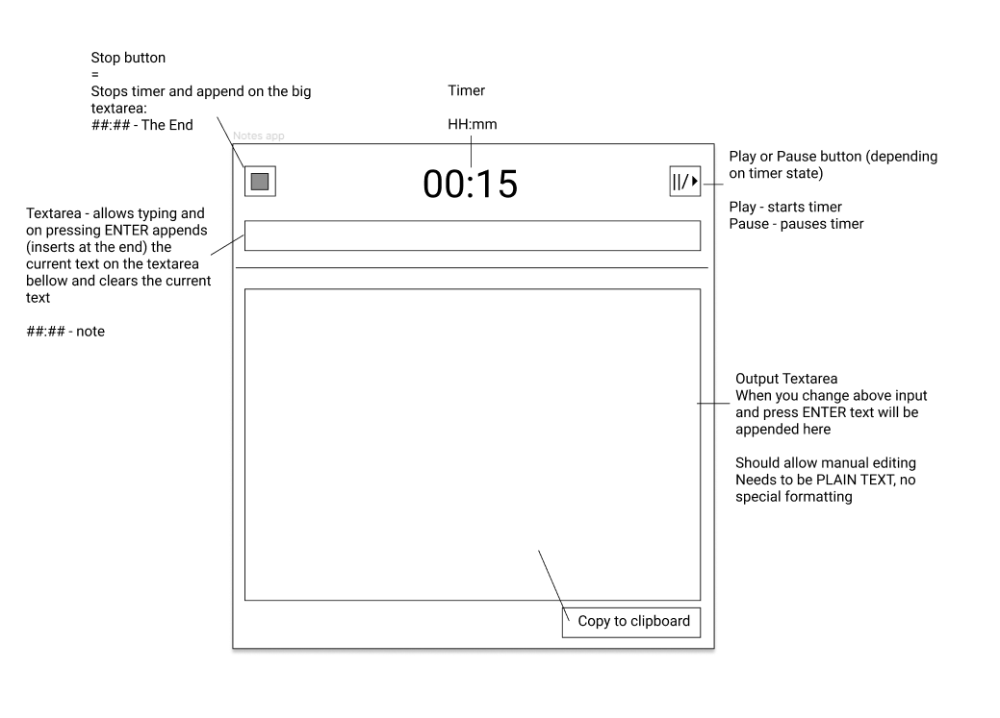

# Timed Notes App

This is an Electron application for taking notes at that specific time.

## Development

- `npm i`
- `npm start`

## References

- [Electron - Build cross-platform desktop apps with JavaScript, HTML, and CSS](https://www.electronjs.org/)
- [Build a Desktop App with Electron... But Should You?](https://www.youtube.com/watch?v=3yqDxhR2XxE)
